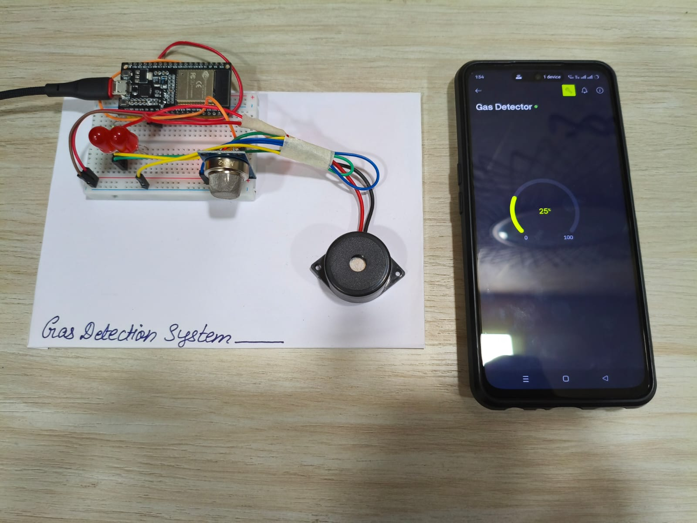
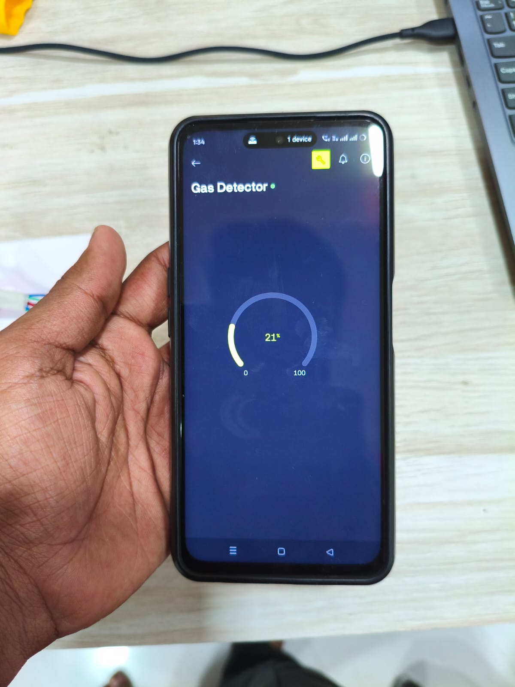
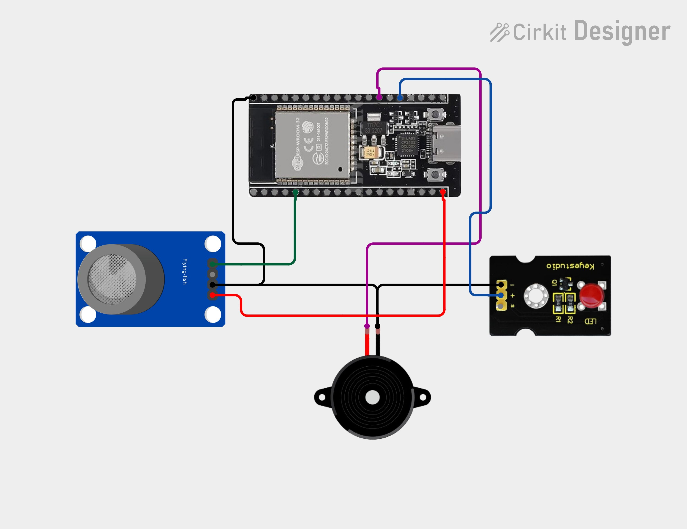

# Gas-Leakage-Detection-System
IoT-based Gas Leakage Detection System using ESP32 and MQ-2 sensor to detect harmful gases in real time. The system triggers a buzzer and LED alert while sending instant mobile notifications via Blynk, providing a low-cost, efficient, and reliable safety solution for homes and industries.
# 🚨 Gas-Leakage-Detection-System

This project is an IoT-based Gas Leakage Detection System using ESP32 and MQ-2 sensor to detect harmful gases in real time. When gas is detected beyond a safe limit, the system activates a buzzer and LED while sending instant alerts to a mobile app using Blynk.

---

# 🚨 Gas Leakage Detection System using ESP32

## 📌 Description

This project is designed to detect gas leakage using the MQ-2 sensor and send alerts through a mobile application. It ensures safety by providing real-time monitoring and immediate response during gas leaks.

---

## ⚙️ Components Used

* ESP32
* MQ-2 Gas Sensor
* Buzzer
* LED
* Breadboard
* Jumper Wires
* WiFi (ESP32 built-in)

---

## 🚀 Features

* Real-time gas detection
* Instant buzzer alert system
* LED indication
* Mobile notification via Blynk
* Low-cost IoT safety solution

---

## 🔌 Working

When gas is detected by the MQ-2 sensor, the ESP32 reads the value and checks it against a predefined threshold. If the level exceeds the limit, the system turns ON the buzzer and LED while sending an alert to the mobile application.

---

## 📸 Project Images

---

## 🔧 Circuit Diagram

---

## 💻 Code

👉 https://github.com/YOUR_USERNAME/Gas-Leakage-Detection-System/tree/main/code

---

## 🎥 Demo Video

👉 https://www.youtube.com/watch?v=YOUR_VIDEO_ID

---

## 🧠 Future Improvements

* Automatic exhaust fan using relay
* Cloud data logging
* LCD/OLED display integration

---
